# 🛍️ Shopply - Shopping list 

**Shopply** is a simple shopping list Android application. The goal of app is to help users plan purchases, make lists and enjoy the shopping.

> Make your daily shopping easily with Shopply

Is also part of my portfolio projects :) It showcases my skills regarding developing Android apps.

## 📸 Screenshots

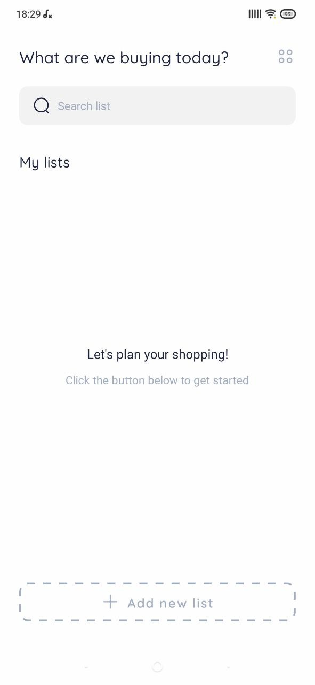 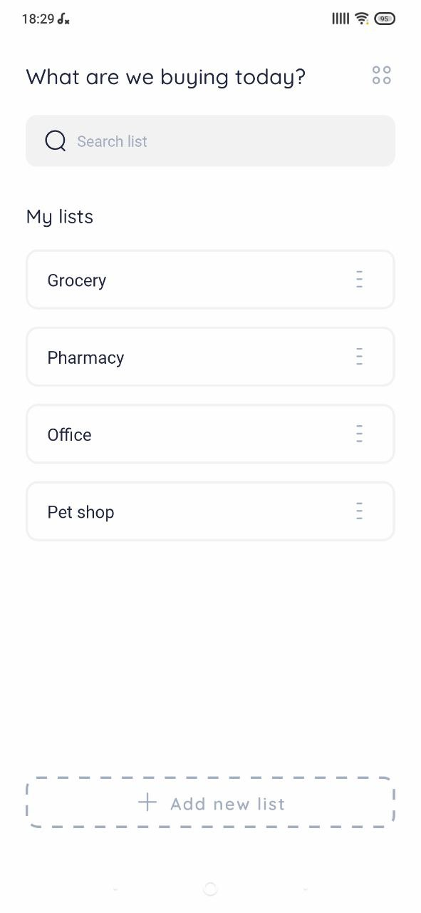 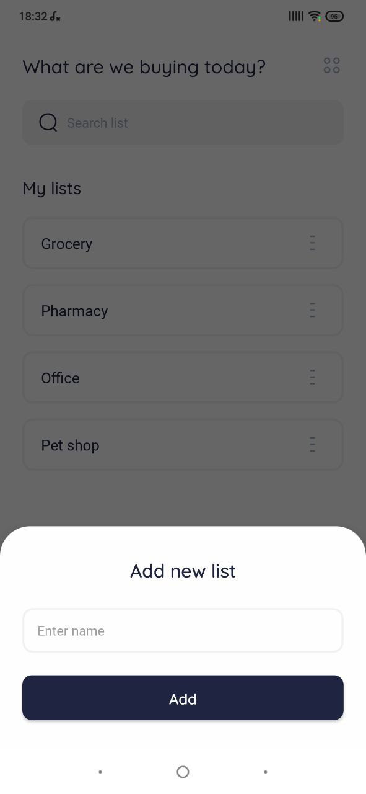
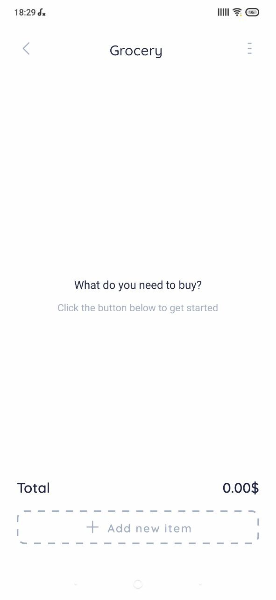 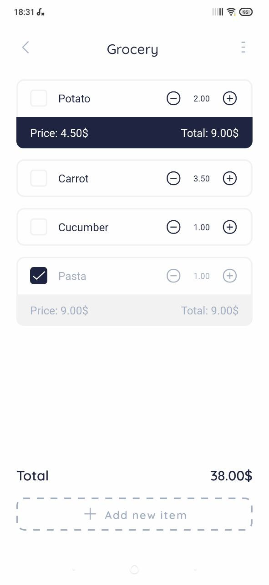 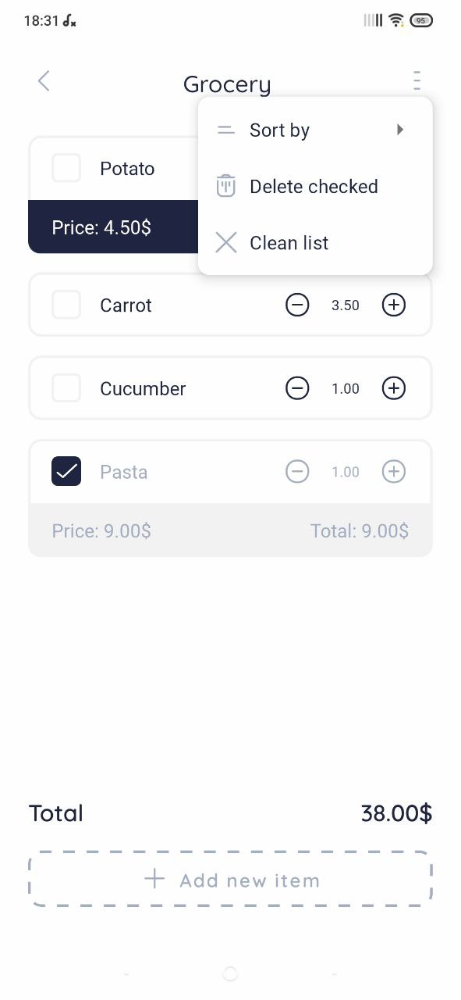
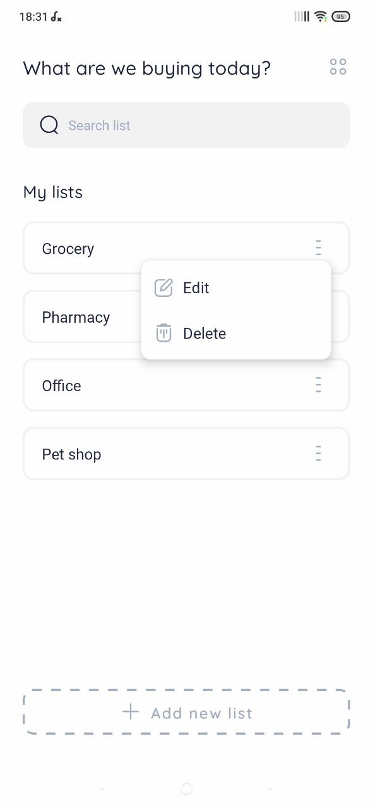 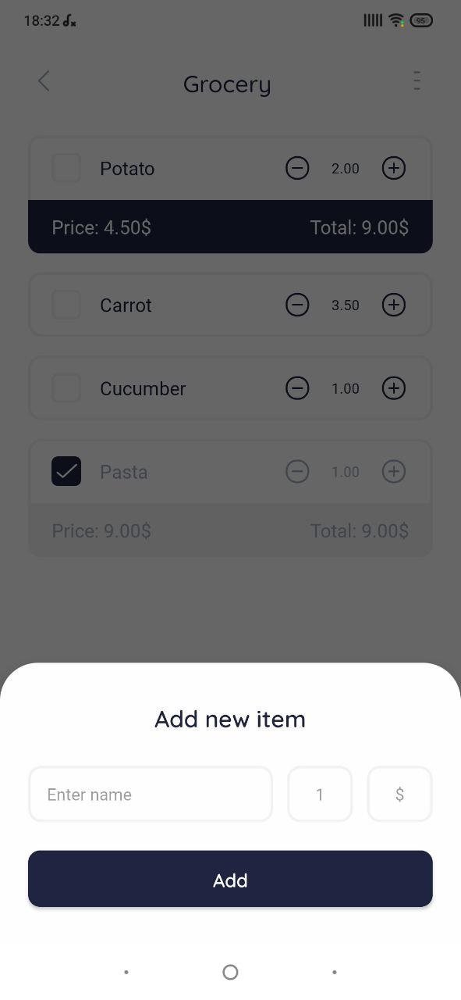 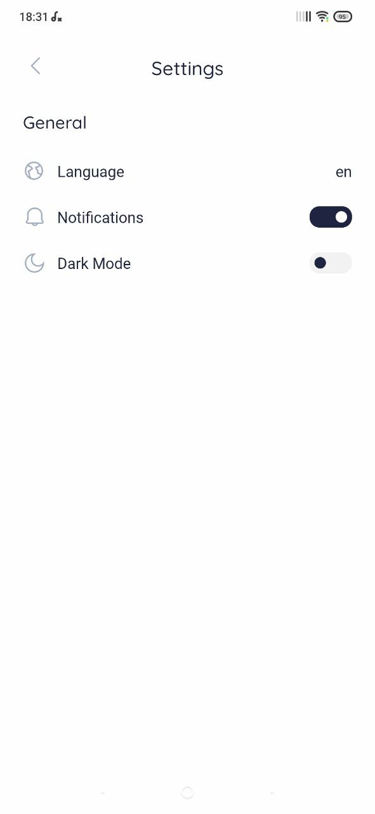
 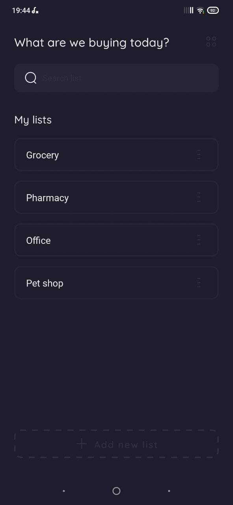 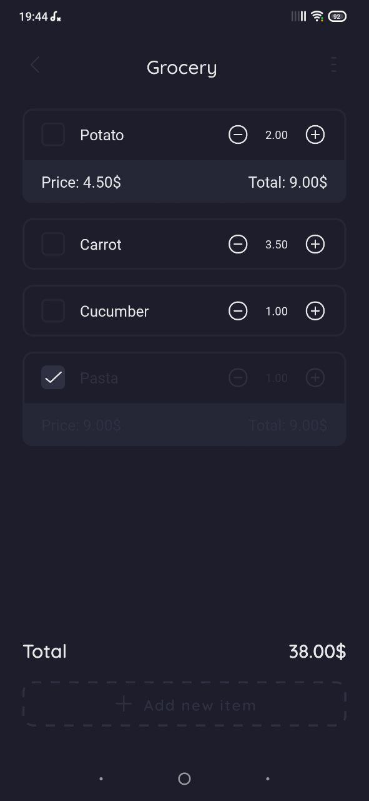

## 🔥 Features

* CRUD operations on lists and items
* Add price and quantity for items
* Calculate total cost
* Light/Dark themes
* All data are stored locally on the device
* Every day notification
* Support for English, Russian, Ukrainian languages

## 🔧 Built With

* Kotlin
* MVVM
* Room
* Coroutines
* Preferences DataStore
* Navigation Component
* View Banding
* Dagger Hilt
* WorkManager
* Safe Args
* Clean Architecture
* Splash Screen api

## ⚡ Getting Started

These instructions will get you a copy of the project up and running on your local machine

### Prerequisites

What things you need to have to build this project.

* Android Studio

### Installing

A step by step to get working project

``` 
1. Clone this repository or download file
2. Extract zip if downloaded code
3. Open project in Android Studio
4. Wait while Android Studio Download gradle or required files
5. Hit Run Button ! 
```

## ✨ Contributing

You can star ⭐ and fork 🍽️ this repository on GitHub by navigating at the top of this repository

## 📝 License

This project is licensed under the MIT License - see the [LICENSE](LICENSE) file for details


